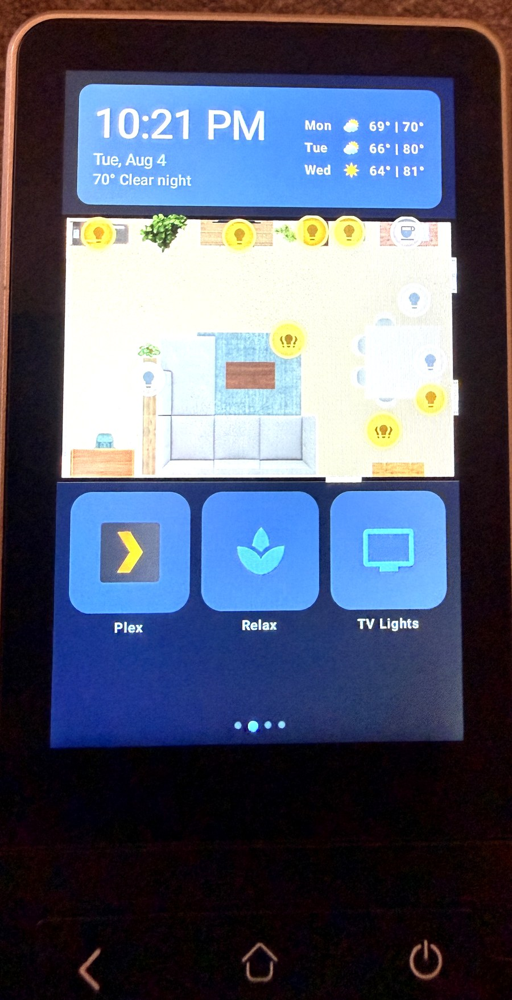

# Astrion HA Dashboard

A native Android dashboard "smart home remotes" — built for the
**Sanytron Astrion HA100** — that talks **directly to Home Assistant over one WebSocket**.
It replaces the stock vendor app entirely.

No Lovelace, no embedded browser, no cloud. State changes land on the screen as fast as
Home Assistant emits them, and the whole layout is one JSON file you can edit without
rebuilding.

> **Status:** in daily use on the author's device. Everything documented here is running on
> real hardware, not aspirational.

<p align="center">
  
</p>

**[▶ Demo video + writeup on r/homeassistant](https://www.reddit.com/r/homeassistant/comments/1vfrrag/sanytron_ha100_remote_working_flawlessly/)** — see it running on the actual remote.

> **Quick start:** grab the APK from [Releases](../../releases), sideload it, then push a
> config with your own Home Assistant details — no build toolchain needed, just ADB. Full
> steps in [docs/SETUP.md](docs/SETUP.md#quick-start-prebuilt-apk). Building from source is
> still supported and required if you want to change behaviour rather than layout.

---

## What it does

| | |
|---|---|
| **Live HA connection** | One WebSocket: auth → `get_states` → `subscribe_events`. Auto-reconnects with backoff. ~450 entities tracked without lag. |
| **Swipeable pages** | Any number, defined in config. Instead of a fixed set of vendor-defined cards, you compose your own. |
| **Tappable floorplan** | Drop a floorplan image in, place dots by percentage coordinates, tap to toggle. Dots recolor live with state. |
| **Physical buttons** | Every hardware key mapped to HA services, IR blasts, page jumps, or device actions. Tap and long-press are separate. |
| **Voice** | Tap-to-talk into HA Assist (works with a local LLM). Client-side silence detection ends the recording. |
| **Media** | Transport controls for any HA `media_player`, plus Plex poster rows (On Deck / Recently Added) — tap to play on a TV client. |
| **Battery reporting** | The remote pushes its own battery level to HA as a sensor so you can alert before it dies. |
| **Survives reality** | Runs as the launcher, comes back after reboot or dead battery, and self-heals the accessibility service this firmware randomly drops. |

## Cards

`bubble_light` · `scene_grid` · `climate` · `cover` · `media_player` · `clock_weather` ·
`picture_elements` (floorplan) · `button_grid` · `plex`

Adding a card type is one new file plus one line in `CardRegistry.kt` — see
[docs/ARCHITECTURE.md](docs/ARCHITECTURE.md#adding-a-card-type).

---

## Start here

| If you want to… | Read |
|---|---|
| Install it on your remote | **[docs/SETUP.md](docs/SETUP.md)** |
| Change pages, cards, entities, dots | **[docs/CONFIG.md](docs/CONFIG.md)** |
| Make the buttons drive *your* TV | **[docs/IR-CODES.md](docs/IR-CODES.md)** |
| Know the device's quirks before they bite you | **[docs/HARDWARE.md](docs/HARDWARE.md)** |
| Understand or extend the code | **[docs/ARCHITECTURE.md](docs/ARCHITECTURE.md)** |
| Recover a bricked/reset remote | **[recovery/RESTORE.md](recovery/RESTORE.md)** |

**Short version:** install JDK 17 + Android SDK, put your HA URL and a long-lived token in
`app/src/main/res/raw/default_dashboard.json`, run `./gradlew assembleRelease`, sideload the
APK. Full detail — including the two commands people always forget — is in
[docs/SETUP.md](docs/SETUP.md).

---

## Hardware

Built and tested on the **Sanytron Astrion HA100**: Android 8.1, MediaTek MT6580, 1 GB RAM,
480×800 portrait touchscreen, IR blaster, and a full physical keypad. Sold under several
names; if yours runs Android and has an IR blaster, most of this applies — the parts that
are device-specific (keycodes, the IR bridge quirk) are called out in
[docs/HARDWARE.md](docs/HARDWARE.md).

It is a slow chip. Build **release**, never debug — the debug build is roughly 14× slower
here and feels broken.

---

## Configuration is the point

Pages, cards, entities, floorplan dot positions, colors, icons, and the physical button map
all live in `default_dashboard.json`. That file is baked into the APK *and* copied to
`/sdcard/astrion/dashboard.json` on first launch, then re-read every time the app resumes:

```bash
adb push dashboard.json /sdcard/astrion/dashboard.json
```

Reopen the app and the change is live. **No rebuild.** Only new card *types* or behavior
changes need Kotlin.

---

## Security

This app authenticates with a **Home Assistant long-lived access token stored in plain text**
in the config file and compiled into the APK. That is a deliberate tradeoff for a wall-mounted
device on a home LAN, but you should know what it means:

- Anyone with the APK or physical access to the device can read the token.
- A long-lived token is **full control of your Home Assistant**.
- **Never commit your real config or a built APK to a public repo.** `.gitignore` covers the
  obvious cases, but check before you push.
- Consider a dedicated HA user with limited access rather than your admin account.
- If a token leaks, revoke it in HA (Profile → Security → Long-lived access tokens).

The same applies to the optional Plex token.

### Why it asks for scary permissions

This app requests three permissions that would be alarming in a normal app. Each is granted
manually over ADB — none can be enabled silently, and the app works (with the noted losses)
if you skip them:

| Permission | Why | Skip it and… |
|---|---|---|
| **Accessibility service** | The firmware's pull-down shortcut launches the vendor app over the dashboard. The service detects that and bounces back, and rescues the Home button. | The vendor app hijacks the screen and you have to swipe back manually. |
| **Device admin** | The only API that lets an app turn the screen off, used for hold-power-to-sleep. | Hold-power-to-sleep does nothing; the screen sleeps on its own timeout. |
| **`WRITE_SECURE_SETTINGS`** | Re-enables the accessibility binding this firmware randomly drops, and keeps the firmware's hair-trigger wake gestures off. | You re-run two ADB commands by hand whenever the binding drops. |

No network destination other than your Home Assistant instance (and your Plex server, if you
configure the Plex card). Nothing is sent anywhere else — read
[`HaClient.kt`](app/src/main/java/com/astrion/remote/ha/HaClient.kt) and
[`BatteryReporter.kt`](app/src/main/java/com/astrion/remote/ha/BatteryReporter.kt) if you want
to confirm that yourself.

---

## Credit and license

MIT — see [LICENSE](LICENSE).

Built on the shoulders of the Home Assistant community's reverse-engineering of these
remotes.

The Plex card was adapted from [baes-cloud/astrion-dashboard](https://github.com/baes-cloud/astrion-dashboard). Thanks Bae! That project is a parallel build on the same hardware and worth a look. It has card types this one doesn't.

Not affiliated with Sanytron, Home Assistant, or Plex. "Plex" is a trademark of Plex GmbH;
no Plex artwork is redistributed here.
